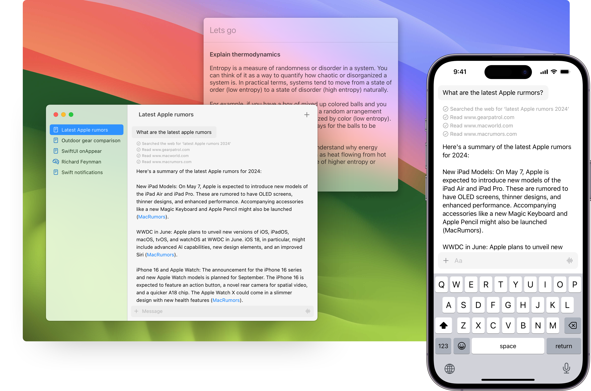

# Heat

More people need to experience open source LLMs. Heat is an open source native iOS and macOS client for interacting with the most popular LLM services. A sister project, [Swift GenKit](https://github.com/nathanborror/swift-gen-kit), attempts to abstract away all the differences across each service including OpenAI, Mistral, Perplexity, Anthropic and all the models available with [Ollama](https://ollama.ai) which you can run locally.

## Features

- Supports popular LLM providers (OpenAI, Mistral, Anthropic, Gemini)
- Supports locally run open source LLMs with Ollama
- Supoprts image gen (Stable Diffusion and Dall-e)
- Launcher similar to Spotlight <kbd>Shift</kbd>+<kbd>Control</kbd>+<kbd>Space</kbd>
- Multi-step tool use (dependent on model)
- Web search and browsing to improve response accuracy
- Calendar reading and understanding
- Filesystem search
- Basic remembering

### Install from TestFlight

https://testflight.apple.com/join/AX9JftGk (March 17, 2024)

### Install locally

1. Build and run in Xcode.
2. Navigate to Preferences > Model Services to provide API keys for services.
3. Pick the models you want to use (or use the defaults).
4. In Preferences set the preferred services you want the app to use for each situation. You can set up multiple services and mix and match to your hearts content.

### Run locally with Ollama

1. Install [Ollama](https://ollama.ai/download) and pull some [models](https://ollama.ai/library)
2. Run the ollama server `ollama serve` 
3. Set up the Ollama service in Preferences > Model Services.
4. In Preferences set the preferred services to use Ollama.

To run the iOS app on your device you'll need to figure out what the local IP is for your computer running the Ollama server. It's usually something like 10.0.0.XXX. Under Preferences > Services > Ollama you can set the IP as long as you stay on your local network. Sometimes Ollama's default port 11434 doesn't work and you'll need to change it to something like 8080 and run the server manually: `OLLAMA_HOST=0.0.0.0:8080 ollama serve`

### Future

Originally the plan for this project was to get models running on-device — hence the name Heat because your device will heat up! — but that was hard. As this becomes more feasible I will revisit. 